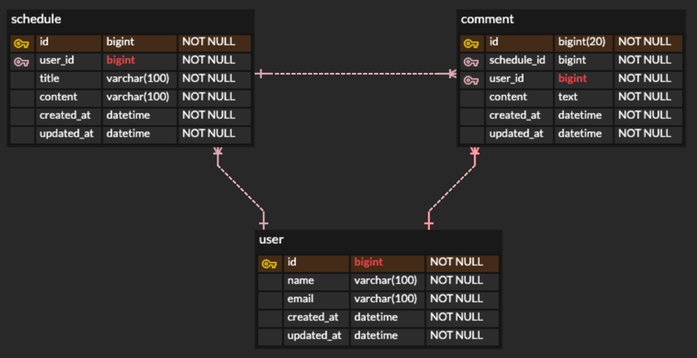

# Architecture

## ERD

[ERD Cloud Snapshot JSON](./erd-snapshot.json)



## API Spec

### 일정 목록 조회

| 항목     | 내용               |
|--------|------------------|
| Method | `GET`            |
| URL    | `/schedules`     |
| 설명     | 전체 일정 목록을 조회합니다. |

#### Parameters

| 이름     | 위치    | 필수 여부 | 타입           | 설명                                   |
|--------|-------|-------|--------------|--------------------------------------|
| `page` | query | 선택    | integer      | 조회할 페이지 번호입니다. `0` 이상이어야 합니다.        |
| `size` | query | 선택    | integer      | 한 페이지에 조회할 데이터 개수입니다. `1` 이상이어야 합니다. |
| `sort` | query | 선택    | string array | 정렬 조건입니다.                            |

#### Response (`200 OK`)

```json
[
  {
    "createdAt": "2026-07-06T10:00:00",
    "updatedAt": "2026-07-06T10:00:00",
    "id": 1,
    "title": "일정 제목",
    "content": "일정 내용",
    "user": {
      "createdAt": "2026-07-06T10:00:00",
      "updatedAt": "2026-07-06T10:00:00",
      "name": "string",
      "email": "test@example.com"
    },
    "comments": [
      {
        "createdAt": "2026-07-06T10:00:00",
        "updatedAt": "2026-07-06T10:00:00",
        "content": "댓글 내용",
        "user": {
          "createdAt": "2026-07-06T10:00:00",
          "updatedAt": "2026-07-06T10:00:00",
          "name": "string",
          "email": "test@example.com"
        }
      }
    ]
  }
]
```

---

### 일정 생성

| 항목     | 내용             |
|--------|----------------|
| Method | `POST`         |
| URL    | `/schedules`   |
| 설명     | 새로운 일정을 생성합니다. |

#### Request

```json
{
  "title": "일정 제목",
  "content": "일정 내용"
}
```

#### Request Body

| 필드        | 타입     | 필수 여부 | 제약 조건   | 설명        |
|-----------|--------|-------|---------|-----------|
| `title`   | string | 필수    | 최대 10자  | 일정 제목입니다. |
| `content` | string | 필수    | 최대 200자 | 일정 내용입니다. |

#### Response (`201 Created`)

```json
{
  "createdAt": "2026-07-06T10:00:00",
  "updatedAt": "2026-07-06T10:00:00",
  "id": 1,
  "title": "일정 제목",
  "content": "일정 내용",
  "user": {
    "createdAt": "2026-07-06T10:00:00",
    "updatedAt": "2026-07-06T10:00:00",
    "name": "string",
    "email": "test@example.com"
  },
  "comments": []
}
```

---

### 일정 단건 조회

| 항목            | 내용                |
|---------------|-------------------|
| Method        | `GET`             |
| URL           | `/schedules/{id}` |
| 설명            | 특정 일정 하나를 조회합니다.  |
| Path Variable | `id`              |

#### Parameters

| 이름   | 위치   | 필수 여부 | 타입      | 설명            |
|------|------|-------|---------|---------------|
| `id` | path | 필수    | integer | 조회할 일정 ID입니다. |

#### Response (`200 OK`)

```json
{
  "createdAt": "2026-07-06T10:00:00",
  "updatedAt": "2026-07-06T10:00:00",
  "id": 1,
  "title": "일정 제목",
  "content": "일정 내용",
  "user": {
    "createdAt": "2026-07-06T10:00:00",
    "updatedAt": "2026-07-06T10:00:00",
    "name": "string",
    "email": "test@example.com"
  },
  "comments": [
    {
      "createdAt": "2026-07-06T10:00:00",
      "updatedAt": "2026-07-06T10:00:00",
      "content": "댓글 내용",
      "user": {
        "createdAt": "2026-07-06T10:00:00",
        "updatedAt": "2026-07-06T10:00:00",
        "name": "string",
        "email": "test@example.com"
      }
    }
  ]
}
```

---

### 일정 수정

| 항목            | 내용                |
|---------------|-------------------|
| Method        | `PUT`             |
| URL           | `/schedules/{id}` |
| 설명            | 특정 일정을 수정합니다.     |
| Path Variable | `id`              |

#### Parameters

| 이름   | 위치   | 필수 여부 | 타입      | 설명            |
|------|------|-------|---------|---------------|
| `id` | path | 필수    | integer | 수정할 일정 ID입니다. |

#### Request

```json
{
  "title": "수정된 일정 제목",
  "content": "수정된 일정 내용"
}
```

#### Request Body

| 필드        | 타입     | 필수 여부 | 제약 조건   | 설명            |
|-----------|--------|-------|---------|---------------|
| `title`   | string | 필수    | 최대 10자  | 수정할 일정 제목입니다. |
| `content` | string | 필수    | 최대 200자 | 수정할 일정 내용입니다. |

#### Response (`200 OK`)

```json
{
  "createdAt": "2026-07-06T10:00:00",
  "updatedAt": "2026-07-06T10:00:00",
  "id": 1,
  "title": "수정된 일정 제목",
  "content": "수정된 일정 내용",
  "user": {
    "createdAt": "2026-07-06T10:00:00",
    "updatedAt": "2026-07-06T10:00:00",
    "name": "string",
    "email": "test@example.com"
  },
  "comments": [
    {
      "createdAt": "2026-07-06T10:00:00",
      "updatedAt": "2026-07-06T10:00:00",
      "content": "댓글 내용",
      "user": {
        "createdAt": "2026-07-06T10:00:00",
        "updatedAt": "2026-07-06T10:00:00",
        "name": "string",
        "email": "test@example.com"
      }
    }
  ]
}
```

---

### 일정 삭제

| 항목            | 내용                |
|---------------|-------------------|
| Method        | `DELETE`          |
| URL           | `/schedules/{id}` |
| 설명            | 특정 일정을 삭제합니다.     |
| Path Variable | `id`              |

#### Parameters

| 이름   | 위치   | 필수 여부 | 타입      | 설명            |
|------|------|-------|---------|---------------|
| `id` | path | 필수    | integer | 삭제할 일정 ID입니다. |

#### Response (`204 No Content`)

```text
```

---

### 댓글 목록 조회

| 항목            | 내용                                 |
|---------------|------------------------------------|
| Method        | `GET`                              |
| URL           | `/schedules/{scheduleId}/comments` |
| 설명            | 특정 일정에 등록된 댓글 목록을 조회합니다.           |
| Path Variable | `scheduleId`                       |

#### Parameters

| 이름           | 위치   | 필수 여부 | 타입      | 설명                |
|--------------|------|-------|---------|-------------------|
| `scheduleId` | path | 필수    | integer | 댓글을 조회할 일정 ID입니다. |

#### Response (`200 OK`)

```json
[
  {
    "createdAt": "2026-07-06T10:00:00",
    "updatedAt": "2026-07-06T10:00:00",
    "content": "댓글 내용",
    "user": {
      "createdAt": "2026-07-06T10:00:00",
      "updatedAt": "2026-07-06T10:00:00",
      "name": "string",
      "email": "test@example.com"
    }
  }
]
```

---

### 댓글 생성

| 항목            | 내용                                 |
|---------------|------------------------------------|
| Method        | `POST`                             |
| URL           | `/schedules/{scheduleId}/comments` |
| 설명            | 특정 일정에 댓글을 생성합니다.                  |
| Path Variable | `scheduleId`                       |

#### Parameters

| 이름           | 위치   | 필수 여부 | 타입      | 설명                |
|--------------|------|-------|---------|-------------------|
| `scheduleId` | path | 필수    | integer | 댓글을 생성할 일정 ID입니다. |

#### Request

```json
{
  "content": "댓글 내용"
}
```

#### Request Body

| 필드        | 타입     | 필수 여부 | 제약 조건   | 설명        |
|-----------|--------|-------|---------|-----------|
| `content` | string | 필수    | 최대 100자 | 댓글 내용입니다. |

#### Response (`201 Created`)

```json
{
  "createdAt": "2026-07-06T10:00:00",
  "updatedAt": "2026-07-06T10:00:00",
  "content": "댓글 내용",
  "user": {
    "createdAt": "2026-07-06T10:00:00",
    "updatedAt": "2026-07-06T10:00:00",
    "name": "string",
    "email": "test@example.com"
  }
}
```

---

### 회원가입

| 항목     | 내용             |
|--------|----------------|
| Method | `POST`         |
| URL    | `/auth/signup` |
| 설명     | 회원가입을 요청합니다.   |

#### Request

```json
{
  "name": "string",
  "email": "test@example.com",
  "password": "password1234"
}
```

#### Request Body

| 필드         | 타입     | 필수 여부 | 제약 조건    | 설명          |
|------------|--------|-------|----------|-------------|
| `name`     | string | 필수    | 최대 40자   | 유저 이름입니다.   |
| `email`    | string | 필수    | email 형식 | 유저 이메일입니다.  |
| `password` | string | 필수    | 최대 40자   | 유저 비밀번호입니다. |

#### Response (`201 Created`)

```json
{
  "createdAt": "2026-07-06T10:00:00",
  "updatedAt": "2026-07-06T10:00:00",
  "name": "string",
  "email": "test@example.com"
}
```

---

### 로그인

| 항목     | 내용            |
|--------|---------------|
| Method | `POST`        |
| URL    | `/auth/login` |
| 설명     | 로그인을 요청합니다.   |

#### Request

```json
{
  "email": "test@example.com",
  "password": "password1234"
}
```

#### Request Body

| 필드         | 타입     | 필수 여부 | 제약 조건    | 설명               |
|------------|--------|-------|----------|------------------|
| `email`    | string | 필수    | email 형식 | 로그인할 유저 이메일입니다.  |
| `password` | string | 필수    | 최대 40자   | 로그인할 유저 비밀번호입니다. |

#### Response (`200 OK`)

```text
```

---

### 로그아웃

| 항목     | 내용             |
|--------|----------------|
| Method | `POST`         |
| URL    | `/auth/logout` |
| 설명     | 로그아웃을 요청합니다.   |

#### Response (`200 OK`)

```text
```

---

### 유저 목록 조회

| 항목     | 내용               |
|--------|------------------|
| Method | `GET`            |
| URL    | `/users`         |
| 설명     | 전체 유저 목록을 조회합니다. |

#### Response (`200 OK`)

```json
[
  {
    "createdAt": "2026-07-06T10:00:00",
    "updatedAt": "2026-07-06T10:00:00",
    "name": "string",
    "email": "test@example.com"
  }
]
```

---

### 유저 단건 조회

| 항목            | 내용               |
|---------------|------------------|
| Method        | `GET`            |
| URL           | `/users/{id}`    |
| 설명            | 특정 유저 하나를 조회합니다. |
| Path Variable | `id`             |

#### Parameters

| 이름   | 위치   | 필수 여부 | 타입      | 설명            |
|------|------|-------|---------|---------------|
| `id` | path | 필수    | integer | 조회할 유저 ID입니다. |

#### Response (`200 OK`)

```json
{
  "createdAt": "2026-07-06T10:00:00",
  "updatedAt": "2026-07-06T10:00:00",
  "name": "string",
  "email": "test@example.com"
}
```

---

### 유저 수정

| 항목            | 내용               |
|---------------|------------------|
| Method        | `PUT`            |
| URL           | `/users/{id}`    |
| 설명            | 특정 유저 정보를 수정합니다. |
| Path Variable | `id`             |

#### Parameters

| 이름   | 위치   | 필수 여부 | 타입      | 설명            |
|------|------|-------|---------|---------------|
| `id` | path | 필수    | integer | 수정할 유저 ID입니다. |

#### Request

```json
{
  "name": "수정된 이름",
  "email": "updated@example.com",
  "password": "newPassword1234"
}
```

#### Request Body

| 필드         | 타입     | 필수 여부 | 제약 조건    | 설명              |
|------------|--------|-------|----------|-----------------|
| `name`     | string | 필수    | 최대 40자   | 수정할 유저 이름입니다.   |
| `email`    | string | 필수    | email 형식 | 수정할 유저 이메일입니다.  |
| `password` | string | 필수    | 최대 40자   | 수정할 유저 비밀번호입니다. |

#### Response (`200 OK`)

```json
{
  "createdAt": "2026-07-06T10:00:00",
  "updatedAt": "2026-07-06T10:00:00",
  "name": "수정된 이름",
  "email": "updated@example.com"
}
```

---

### 유저 삭제

| 항목            | 내용            |
|---------------|---------------|
| Method        | `DELETE`      |
| URL           | `/users/{id}` |
| 설명            | 특정 유저를 삭제합니다. |
| Path Variable | `id`          |

#### Parameters

| 이름   | 위치   | 필수 여부 | 타입      | 설명            |
|------|------|-------|---------|---------------|
| `id` | path | 필수    | integer | 삭제할 유저 ID입니다. |

#### Response (`204 No Content`)

```text
```